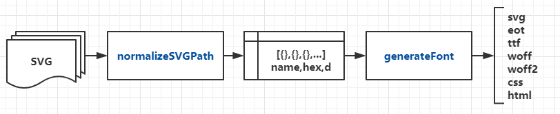

# iconfont-core

> 提供制作 iconfont 的核心方法`normalizeSVGPath`和`generateFont`。

[](https://badge.fury.io/js/iconfont-core)



## Usage

Install iconfont-core

```
npm i iconfont-core
```

In your scripts

```javascript
const fs = require("fs");
const { normalizeSVGPath, generateFont } = require("iconfont-core");

// read file
const icon_safe = fs.readFileSync("./svg/safe.svg");
const icon_say = fs.readFileSync("./svg/say.svg");
const icon_set = fs.readFileSync("./svg/set.svg");

// normalize && generate
const font = generateFont([
  {
    name: "safe",
    hex: 0xe000,
    d: normalizeSVGPath(icon_safe)
  },
  {
    name: "say",
    hex: 0xe001,
    d: normalizeSVGPath(icon_say)
  },
  {
    name: "set",
    hex: 0xe002,
    d: normalizeSVGPath(icon_set)
  }
]);

// write file
fs.writeFileSync("./dist/font.svg", font.svg);
fs.writeFileSync("./dist/font.eot", font.eot);
fs.writeFileSync("./dist/font.ttf", font.ttf);
fs.writeFileSync("./dist/font.woff", font.woff);
fs.writeFileSync("./dist/font.woff2", font.woff2);
fs.writeFileSync("./dist/font.css", font.css);
fs.writeFileSync("./dist/font.html", font.html);
```

## API

### normalizeSVGPath(buffer)

### generateFont(icons [, fontName, prefix])

## License

[MIT](http://opensource.org/licenses/MIT)
